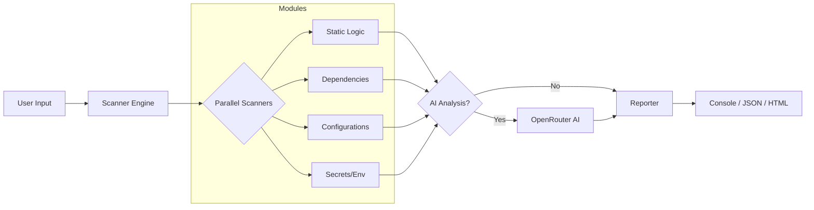

# 🛡️ LaraSAST: Laravel Static Analysis Security Tool

**LaraSAST** is a high-performance Static Analysis Security Testing (SAST) tool purpose-built for the Laravel ecosystem. It combines pattern-based scanning, integration with industry-standard security tools, and AI-powered insights to identify vulnerabilities in your Laravel source code before they reach production.


## ✨ Key Features

- **Multi-threaded Scanning**: Executes multiple security modules concurrently for rapid results.
- **AI-Powered Insights**: Integrates with OpenRouter (Mistral/Gemini) to provide Proof-of-Concept (PoC) scenarios and specific mitigation advice.
- **Professional Reporting**: Generates interactive HTML reports, structured JSON, and beautiful terminal outputs using `rich`.
- **Deep Integration**: Wraps powerful tools like `Semgrep`, `Grype`, and `Nuclei` for a comprehensive security audit.


## ⚙️ Requirements

### 1. External Security Tools

To utilize the full power of LaraSAST, ensure the following are installed in your system PATH:

- **Python 3.8+**
- **Semgrep**: For advanced pattern matching.
- **Grype & Syft**: For software composition analysis (SCA) and dependency auditing.
- **Nuclei**: For template-based vulnerability scanning.
- **PHP & Composer**: Required for auditing `composer.lock` and Laravel-specific structures.

### 2. Python Modules

The tool relies on the following libraries:

- `rich`: For terminal formatting and UI components.
- `requests`: For AI API communication.


## 🚀 Installation & Setup

### Python Environment Setup

It is highly recommended to use a virtual environment to manage dependencies:

```bash
# Clone the repository
git clone https://github.com/yourusername/lara-sast.git
cd lara-sast

# Create a virtual environment
python -m venv venv

# Activate the environment
# On Windows:
venv\Scripts\activate
# On Linux/Mac:
source venv/bin/activate

# Install required modules
pip install rich requests
```


## 📊 Tool Workflow




## 💻 Usage & Examples

### Standard Console Scan

```bash
python main.py /path/to/laravel-project --severity MEDIUM
```

### AI-Enhanced HTML Report

```bash
# Set your API key
export OPENROUTER_API_KEY='your_key_here'

# Run scan with AI and HTML output
python main.py /path/to/laravel-project --format html --ai --ai-model "google/gemini-pro-1.5"
```


## 🛠️ CLI Options

| Option          | Description                                                                     | Default                              |
| :-------------- | :------------------------------------------------------------------------------ | :----------------------------------- |
| `path`          | **Required.** Absolute or relative path to the Laravel project.                 | N/A                                  |
| `--format`      | Output format: `text`, `json`, or `html`.                                       | `text`                               |
| `--severity`    | Minimum severity level to display: `INFO`, `LOW`, `MEDIUM`, `HIGH`, `CRITICAL`. | `LOW`                                |
| `--ai`          | Enable AI-driven PoC and mitigation analysis.                                   | `Disabled`                           |
| `--ai-model`    | The OpenRouter model ID to use for analysis.                                    | `mistralai/mistral-7b-instruct-v0.2` |
| `--list-models` | Fetch and list available models from OpenRouter.                                | N/A                                  |


## 🔬 Scanner Modules

LaraSAST employs a variety of specialized modules to detect different types of vulnerabilities. Each module focuses on a specific aspect of Laravel application security.

| Module Name              | Description                                                                                                   |
| :----------------------- | :------------------------------------------------------------------------------------------------------------ |
| `EnvScanner`             | Checks for `.env` file exposure and sensitive configurations.                                                 |
| `RouteScanner`           | Analyzes Laravel routes for potential misconfigurations or exposed endpoints.                                 |
| `UploadScanner`          | Identifies insecure file upload functionalities.                                                              |
| `IdorScanner`            | Scans for Insecure Direct Object Reference (IDOR) patterns.                                                   |
| `DependencyChecker`      | Audits project dependencies using `Grype` and `Syft` for known vulnerabilities.                               |
| `SemgrepWrapper`         | Integrates `Semgrep` for advanced static code analysis based on custom and community rules.                   |
| `NucleiWrapper`          | Utilizes `Nuclei` templates for detecting various security issues.                                            |
| `SecretScanner`          | Detects hardcoded secrets, API keys, and credentials.                                                         |
| `ExposureScanner`        | Checks for information exposure through sensitive files or directories.                                       |
| `LogicScanner`           | Identifies dangerous functions (e.g., `eval`, `shell_exec`) and debug code (`dd`, `dump`) left in production. |
| `ConfigHardeningScanner` | Reviews Laravel configuration files for security hardening best practices.                                    |
| `XssScanner`             | Scans for potential Cross-Site Scripting (XSS) vulnerabilities.                                               |
| `MassAssignmentScanner`  | Detects Laravel models vulnerable to mass assignment.                                                         |
| `SqlInjectionScanner`    | Identifies potential SQL Injection vulnerabilities.                                                           |
| `CsrfScanner`            | Analyzes CSRF protection implementation, especially for bypassed routes.                                      |
| `VersionScanner`         | Checks for outdated Laravel or PHP versions.                                                                  |


## ️ Screenshots

### Terminal Interface

![!\[Terminal Screenshot Placeholder\]](https://raw.githubusercontent.com/gh1mau/laraSAST/refs/heads/main/screenshots/t1.jpg)


_The terminal uses Rich for a dashboard-like experience during scans._

### Professional HTML Report


_Interactive reports including Chart distribution and AI-generated PoCs._


## 📝 TODO List

- [ ] **CI/CD Integration**: Create a GitHub Action for automated scanning on Pull Requests.
- [ ] **PDF Export**: Add support for generating high-quality PDF reports for stakeholders.
- [ ] **Docker Scanner**: Implement logic to scan `Dockerfile` and `docker-compose.yml` for security misconfigurations.
- [ ] **Custom Ruleset**: Allow users to provide their own Semgrep or Nuclei rules via the CLI.
- [ ] **False Positive Filtering**: Implement a "mark as resolved" feature in the JSON configuration.


**Maintainer:** **Hussein bin Mohamed | masta ghimau**  
**License:** MIT


